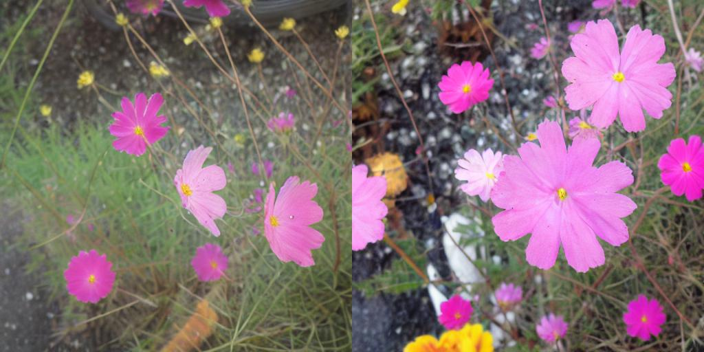
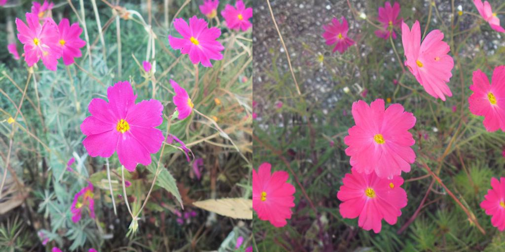
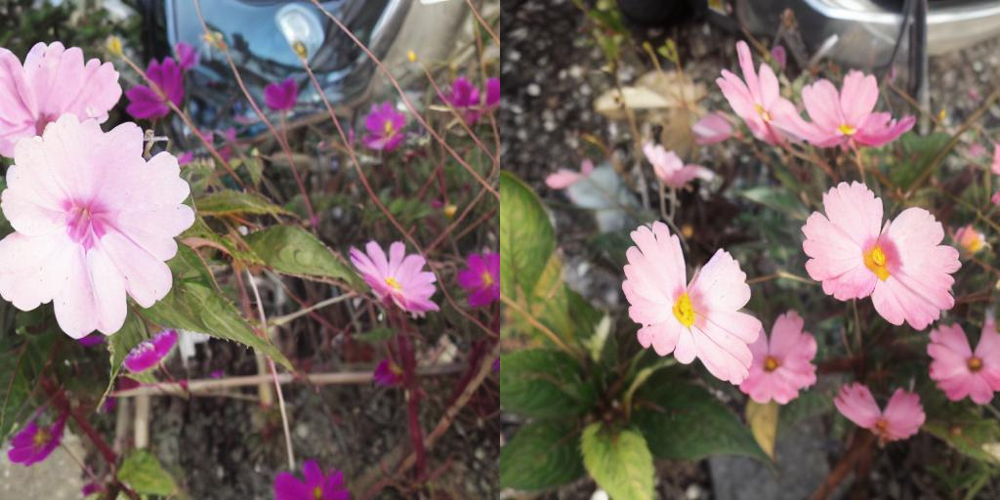
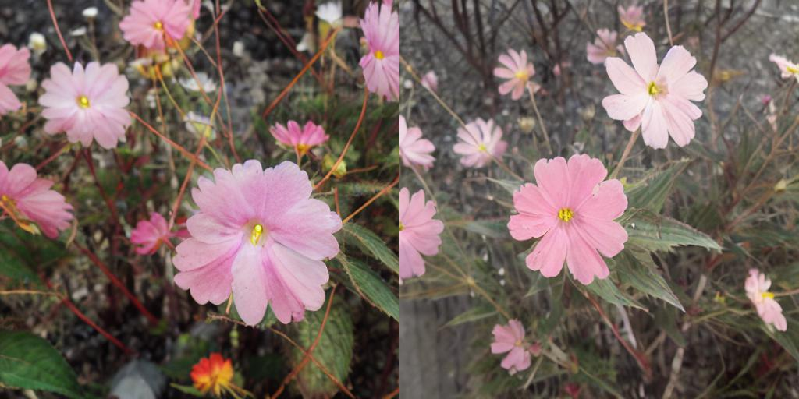
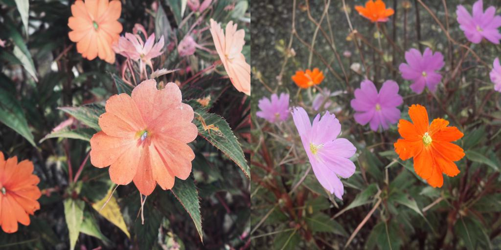
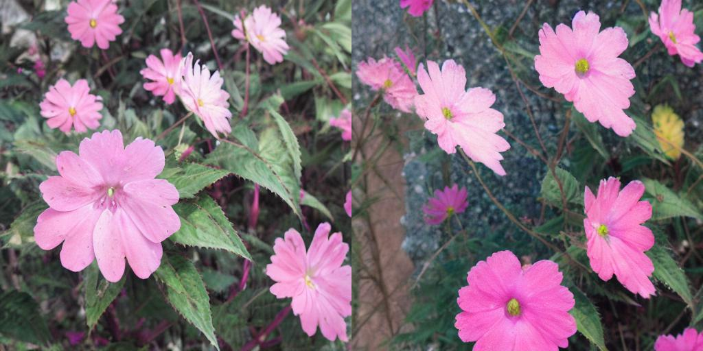
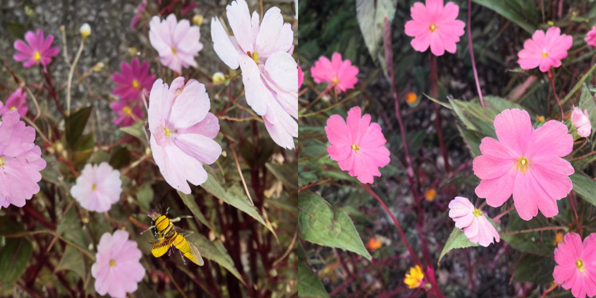
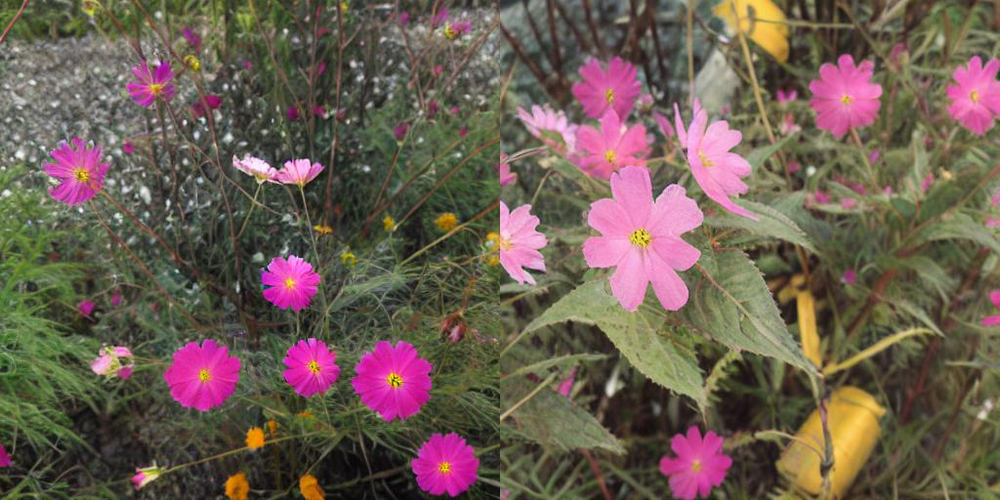
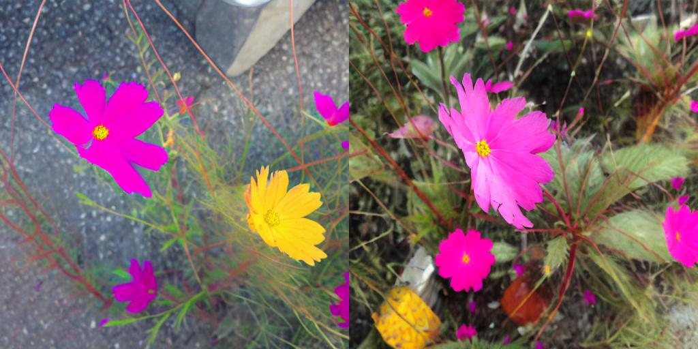
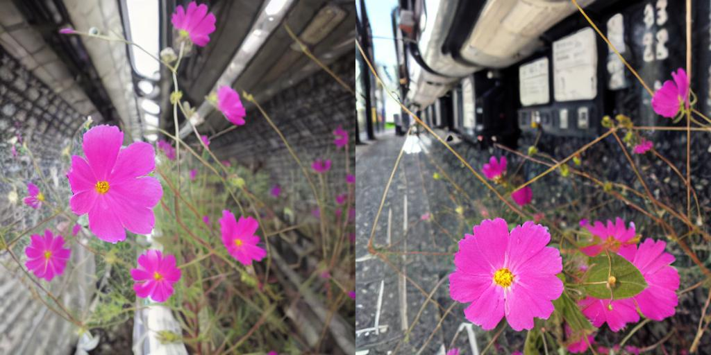

# Stable-Diffusion-Flower

This is my very first stable-diffusion trial. The flower images under flower_dataset are used for training a model. The all iamges were taken by my camera.

<h3 align="center">Prompt : A photo of a colorful flower in the Acropolis</h3>

<h3 align="center">Prompt : A photo of a flower and a dog</h3>

<h3 align="center">Prompt : A photo of a flower in mosaic style</h3>

<h3 align="center">Prompt : A photo of a flower in the bus</h3>

<h3 align="center">Prompt : A photo of a flower on the human face</h3>

<h3 align="center">Prompt : A photo of an orange flower</h3>

<h3 align="center">Prompt : A photo of beautiful flower in oil paint sytle</h3>

<h3 align="center">Prompt : A photo of flowers and bees</h3>

<h3 align="center">Prompt : A photo of flowers in the garden</h3>

<h3 align="center">Prompt : A photo of rainbow flower</h3>

<h3 align="center">Prompt : A picture of a flower in the subway</h3>

## Reference
HuggingFace material [[Link]](https://github.com/huggingface/diffusion-models-class/tree/main/unit3)

